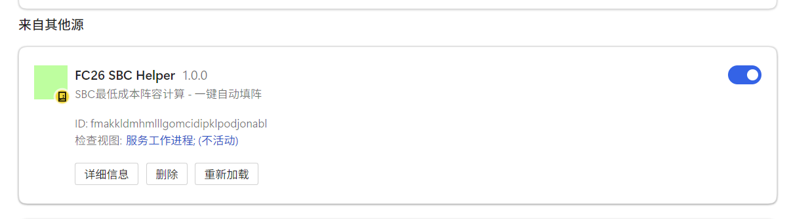
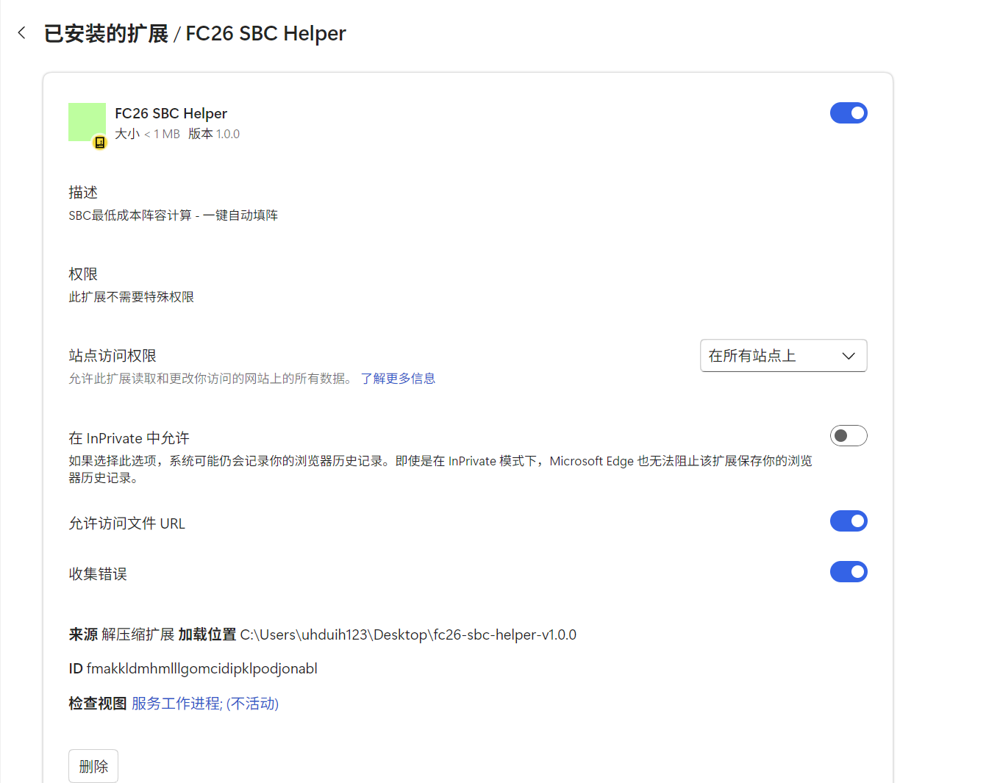
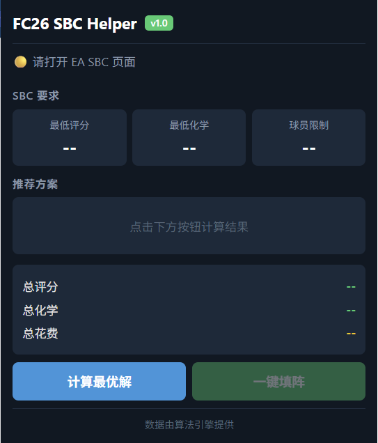
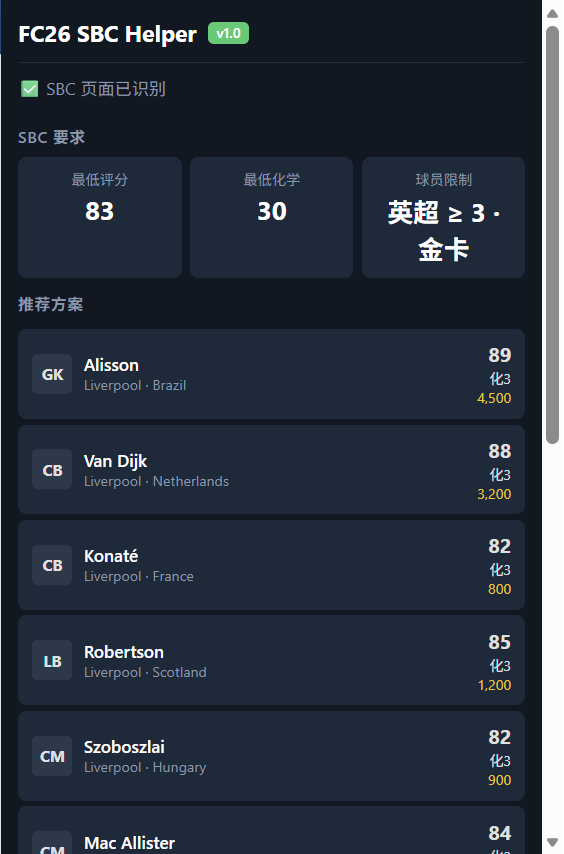
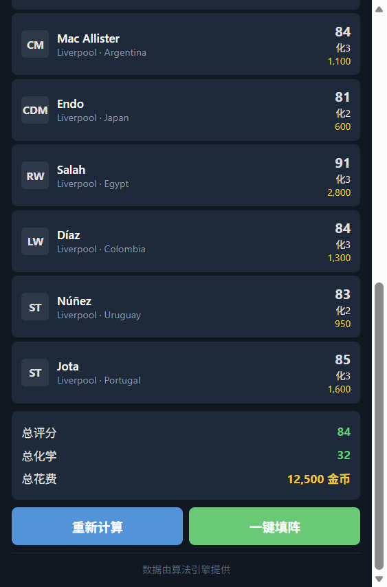
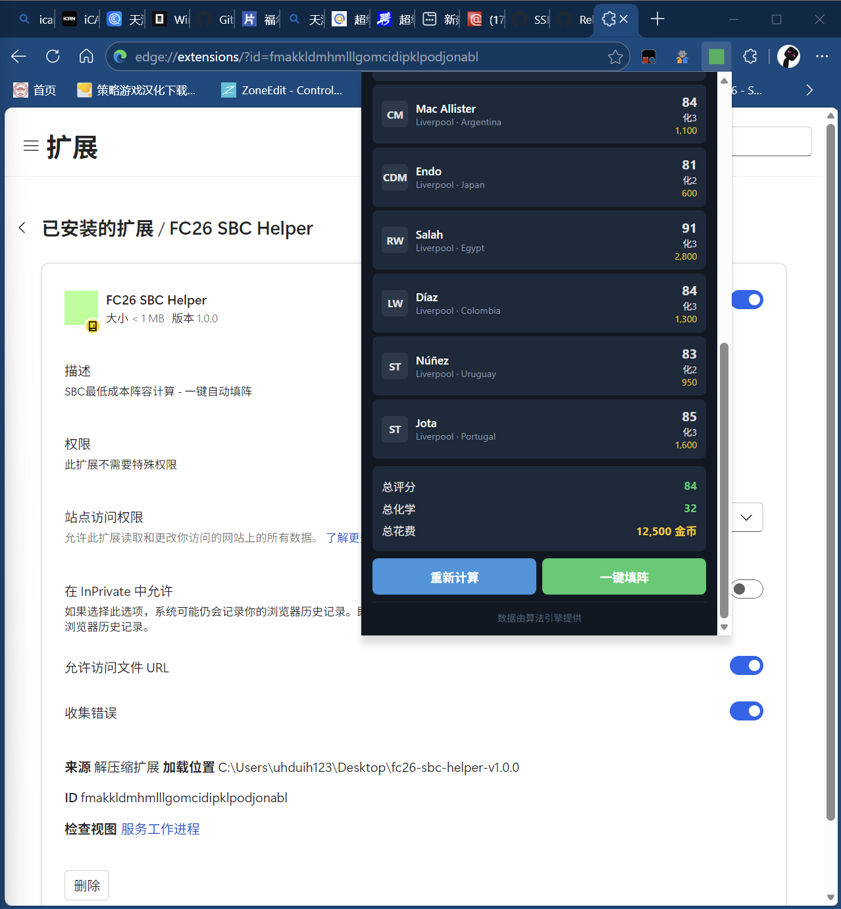
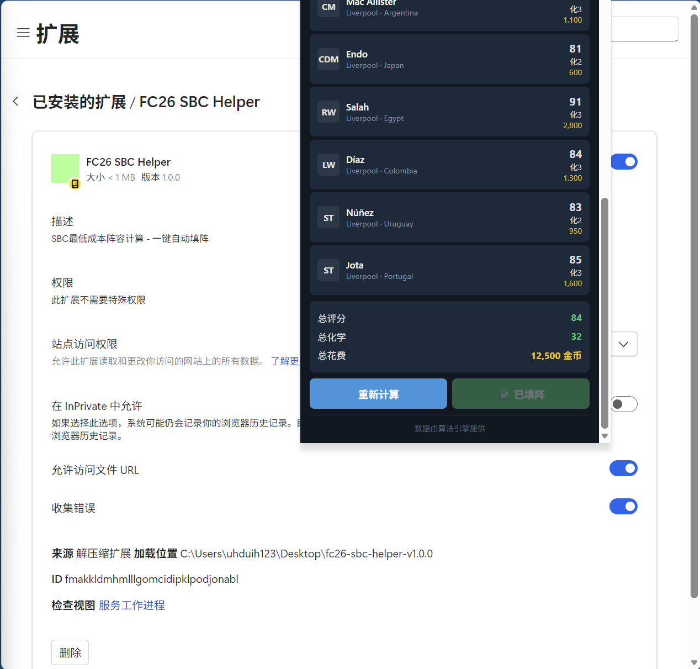
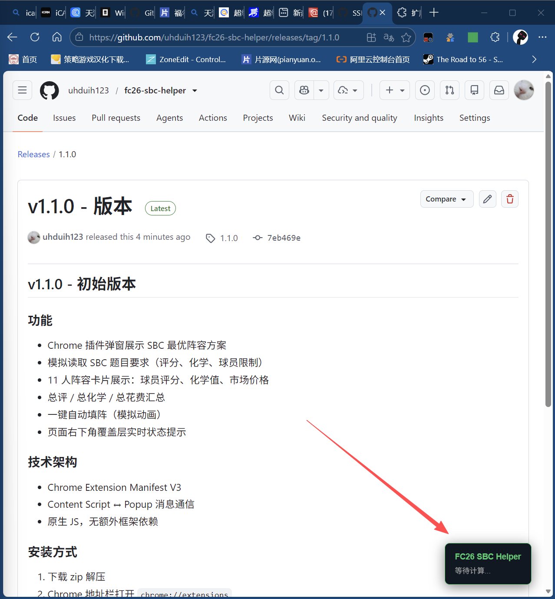

# FC26 SBC Helper - Chrome 扩展

FC26 (EA FC) 终极团队 SBC 辅助工具 Chrome 插件。自动读取 SBC 题目要求，计算最低成本阵容，一键自动填阵。

## 截图










## 功能

- 点击插件图标，弹窗展示 SBC 最优阵容方案
- 11 人阵容卡片：球员评分、化学值、市场价格
- 总评分 / 总化学 / 总花费汇总
- 一键自动填阵：覆盖层实时显示填阵进度
- 模拟读取 SBC 题目要求（评分、化学、球员限制）

## 技术栈

- Chrome Extension Manifest V3
- **React 18** — Popup 弹窗界面（本地加载，绕开 CSP 限制）
- **原生 DOM** — 页面覆盖层（稳定可靠，无额外依赖）
- `chrome.runtime.sendMessage` 通信

## 项目结构

```
├── manifest.json       # 扩展配置文件
├── popup.html          # 弹窗界面
├── popup.js            # React 组件（React.createElement）
├── react.min.js        # React 18 核心库
├── react-dom.min.js    # React DOM 库
├── styles.css          # 全局样式
├── content.js          # 内容脚本（创建覆盖层 + 消息处理）
├── background.js       # 后台 Service Worker
├── screenshots/        # 使用截图
└── icon.png            # 图标
```

## 安装

1. Chrome 地址栏输入 `chrome://extensions/`
2. 右上角开启 **开发者模式**
3. 点击 **加载已解压的扩展程序**
4. 选择本项目文件夹
5. 点击右上角拼图图标，固定本插件

## 数据流

```
用户打开网页 → 点击插件图标
        ↓
Popup（React）展示操作界面
        ↓ 点击"计算最优解"
chrome.runtime.sendMessage → content.js
        ↓
Popup 显示阵容方案（评分、化学、价格）
        ↓ 点击"一键填阵"
chrome.runtime.sendMessage → content.js
        ↓
页面右下角覆盖层显示填阵进度
```

## 开发说明

数据和算法引擎由后端团队提供，本插件专注于前端展示与页面交互。
